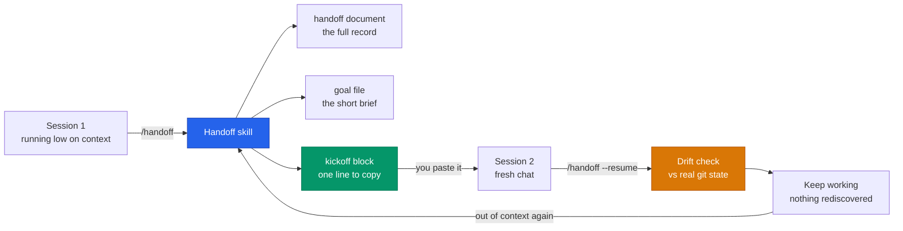
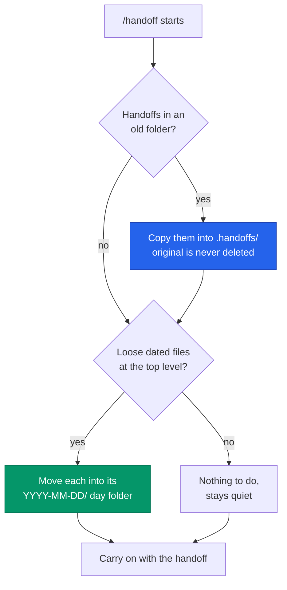
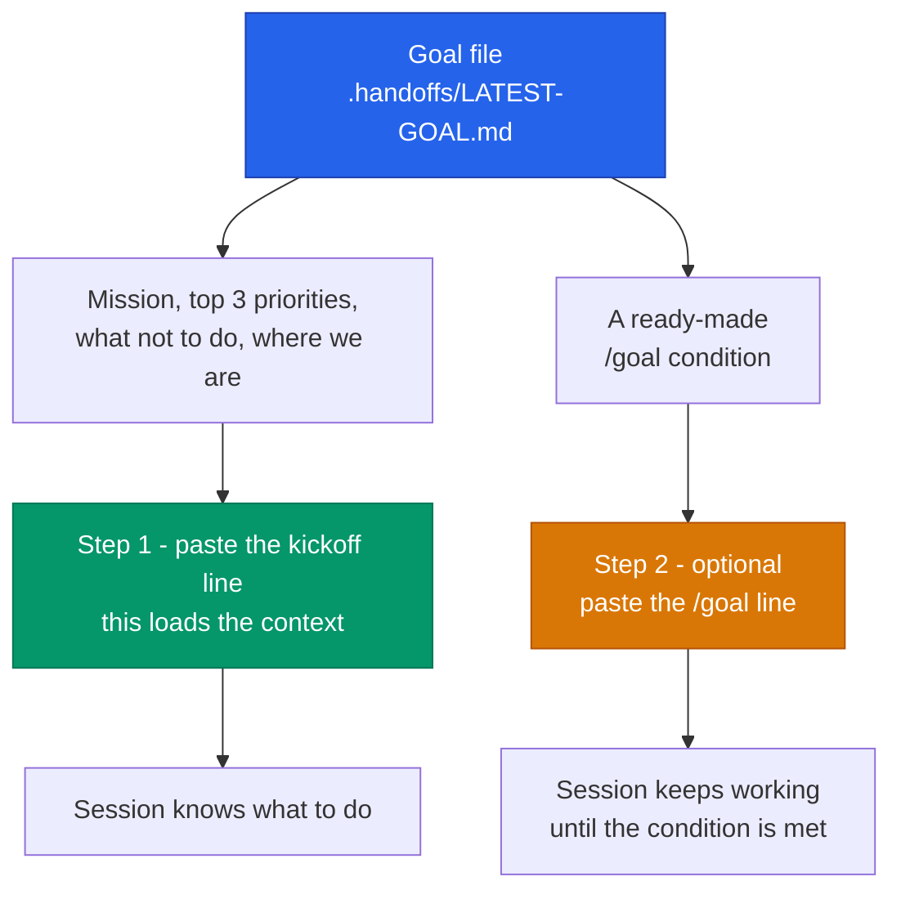
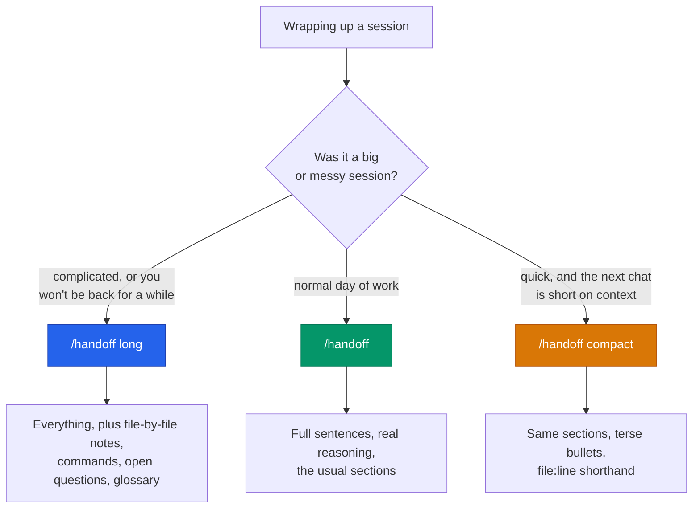
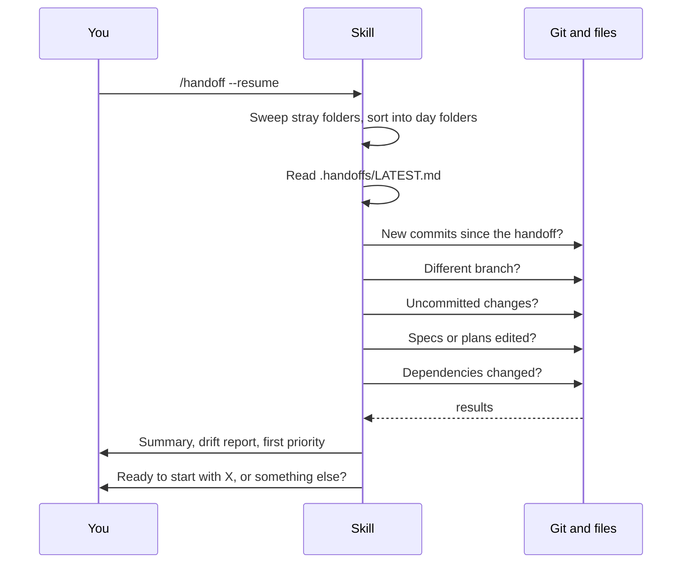

# handoff

Session handoff for coding agents. End a session, pick it back up later, lose nothing.

---

## TL;DR

- **What it is:** a skill for Claude Code and Codex. Run `/handoff` in Claude Code or `$handoff` in Codex when you are out of context or done for the day, and it writes down everything the next chat needs.
- **What you get:** a full handoff document, a short goal file, and a one-line kickoff message to paste into your next chat.
- **Where files go:** `.handoffs/` in your project, sorted into day folders like `.handoffs/2026-08-16/`.
- **Next session:** paste the kickoff line, then run `/handoff --resume` in Claude Code or `$handoff --resume` in Codex. It checks the handoff against your real git state and tells you what moved.
- **Every handoff starts with rules** for the next chat: write in plain language, lead with a `TL;DR`, and split independent work across an agent team so the main chat stays small.
- **Three sizes:** compact, normal, and long.

> **Command syntax:** Claude Code invokes the skill as `/handoff`; Codex invokes it as `$handoff`. The options and bare-word aliases are identical. Examples later in this README use Claude Code's slash form unless both forms are shown.

---

## How it works



Without a handoff, a new chat spends its first 10 to 15 minutes rediscovering things the last chat already knew. This removes that.

---

## Install

### Claude Code

```bash
# Add the marketplace
/plugin marketplace add josuemarlique/claude-plugins

# Install the plugin
/plugin install handoff@jmarlique-tools
```

### Codex

```bash
codex plugin marketplace add josuemarlique/claude-plugins
codex plugin add handoff@jmarlique-tools
```

To test a local checkout of the catalog itself, add the marketplace repository, not this individual plugin repository:

```bash
codex plugin marketplace add /path/to/claude-plugins
codex plugin add handoff@jmarlique-tools
```

The marketplace checkout must contain `.agents/plugins/marketplace.json`, which tells Codex where to fetch Handoff. Pointing `codex plugin marketplace add` at `/path/to/handoff` does not work because this repository is a plugin, not a marketplace.

The marketplace itself lives in [josuemarlique/claude-plugins](https://github.com/josuemarlique/claude-plugins), which lists every plugin.
This repository, [josuemarlique/handoff](https://github.com/josuemarlique/handoff), holds only the handoff plugin.

After changing the plugin locally, reinstall it and start a new thread so the updated skill loads.

### Updating to a newer version

#### Claude Code

If you already have it installed, **one command**:

```
/plugin marketplace update jmarlique-tools
```

That refreshes the marketplace and the plugins installed from it, in the same step. Then:

```
/reload-plugins
```

to apply it without restarting, or just start a new chat.

Do **not** run `/plugin install` again. There is no `/plugin update` command, and `install` is for first-time setup only - if the plugin is already there it simply reports "already installed" and changes nothing. That is expected, not an error.

To check which version you actually have, use `/plugin manage`, or look at the file directly:

```bash
grep -A3 'handoff@jmarlique-tools' ~/.claude/plugins/installed_plugins.json
```

If the version is still the old one, uninstall and reinstall:

```
/plugin uninstall handoff
/plugin install handoff@jmarlique-tools
```

#### Codex

Refresh the Git marketplace snapshot, then reinstall Handoff from it:

```bash
codex plugin marketplace upgrade jmarlique-tools
codex plugin add handoff@jmarlique-tools
```

Start a new Codex thread after reinstalling so the updated skill is loaded. Check the installed entry with `codex plugin list`. If it still resolves to stale content, remove and add it again:

```bash
codex plugin remove handoff@jmarlique-tools
codex plugin add handoff@jmarlique-tools
```

---

## Quick start

| Task | Claude Code | Codex |
| --- | --- | --- |
| End a session | `/handoff` | `$handoff` |
| Generate the detailed version | `/handoff long` | `$handoff long` |
| Resume in the next session | `/handoff --resume` | `$handoff --resume` |

At the start of the next session, paste the kickoff line the skill printed before invoking resume.

You can also just say "continue from last handoff" or "pick up where we left off".

---

## Where files go

There is exactly one correct location: **`.handoffs/` at the root of your project.** Not `.claude/handoffs/`, not `.claude/.handoffs/`, not `docs/handoffs/`. The same path works for Claude Code and Codex, which is the point of keeping it outside `.claude/`.

Timestamped files are sorted into day folders so the directory stays readable after a few months of use.

```
.handoffs/
├── LATEST.md                        <- always the newest handoff
├── LATEST-PROMPT.md                 <- always the newest continuation prompt
├── LATEST-GOAL.md                   <- always the newest goal file
│
├── 2026-08-16/
│   ├── 2026-08-16-14-30-handoff.md
│   ├── 2026-08-16-14-30-prompt.md
│   ├── 2026-08-16-14-30-goal.md
│   └── 2026-08-16-09-05-handoff.md
│
└── 2026-08-14/
    └── 2026-08-14-17-40-handoff.md
```

The three `LATEST*.md` files never move, so anything pointing at them keeps working forever.

### Already have handoffs in the wrong place?

Nothing to do. The first time you run `/handoff` after upgrading, it sweeps every known wrong location into `.handoffs/`, sorts loose files into day folders, and tells you what it moved.



Old folders are left in place as an archive. You delete them yourself once you have checked the new folder looks right.

Folders that get swept: `.claude/handoffs/`, `.claude/.handoffs/`, `.codex/handoffs/`, `.Codex/handoffs/`, `docs/handoffs/`, and a plain `handoffs/`. A folder is only touched if it actually contains handoff files, so an unrelated folder named `handoffs` is left alone.

### When it is properly messy: `/handoff --reconcile`

The automatic sweep is quiet and only handles tidy cases. When a project has been through a few versions of this skill, run the repair mode instead:

```
/handoff --reconcile
```

It reports first and changes nothing until you say go. It catches the things the quiet sweep cannot:

| It finds | Why that matters |
|---|---|
| History in several folders at once | Each one has its own `LATEST.md`, so resume reads whichever it finds first |
| The same filename in two folders, different content | A plain copy would silently drop one |
| A `LATEST.md` matching no dated file | That handoff exists in one copy only, and the next run overwrites it. This is real data loss, and it has already happened in one project. |
| Filenames that break the convention | `--list` and the freshness check skip them, so they are invisible |
| A prompt or goal file whose handoff is gone | Half a handoff |
| Handoffs somewhere nobody planned for | Not covered by the automatic sweep at all |

Sample report:

```
Handoff reconcile
=================

Where your handoffs live now
  .handoffs/                     1 handoff,   0 prompt,   0 goal   (correct)
  .claude/handoffs/             30 handoff,  30 prompt,   0 goal   (needs merging)
  docs/handoffs/                 1 handoff,   0 prompt,   0 goal   (needs merging)

Things worth knowing
  1. Rescue: `.claude/handoffs/LATEST.md` matches no dated file, so that handoff
     exists in one copy only and the next run would overwrite it.
  2. Name collision: two folders hold a different `2026-06-24-14-02-handoff.md`.
     The incoming copy would be kept alongside it so neither is lost.
  3. Orphan: `2026-07-05-13-00-prompt.md` has no matching handoff document.

Nothing was changed. This was a report.
```

Nothing is ever deleted. Files already in `.handoffs/` get moved into their day folder; everything else is copied, so the original stays where it is. Running it twice is safe.

---

## What is in a handoff

Every handoff opens with the same two blocks, in every size, so the next chat starts on the right foot.

**1. `## Start Here`** - the rules for the next session:

- Write in plain, everyday language, like you are explaining it to a smart middle school student.
- Spell out short forms the first time, like "continuous integration (CI)".
- Start every reply with a short `TL;DR` and end with a one-line `TL;DR`.
- Use an agent team for independent pieces of work and run them at the same time. In Claude Code, saying **"fan out subagents"** is a reliable way to start one. Keep the main chat for decisions and review so its context stays small.
- Run the Handoff skill in resume mode: `/handoff --resume` in Claude Code or `$handoff --resume` in Codex.

That last rule is the one that buys you time. Each teammate gets its own context window, and only its short report comes back, so the main chat fills up far more slowly. The "What's Next" section marks which items are independent, so the next session knows what it can safely split.

**2. `## TL;DR`** - five bullets: where we are, what got done, what is next, what to watch out for, and the current test and build state.

Then the record itself:

| Section | What it holds |
|---|---|
| Refined Intent | What the session was actually trying to do |
| What Was Built | Deliverables grouped by concern, not a diary |
| Decisions Made | Choices plus the reasoning behind them |
| Friction Points | What went wrong, what was tried, what worked |
| Current State | Branch, commit, tests, build, uncommitted work |
| What's Next | Priority-ordered, with a note on which items can run in parallel |
| Environment Notes | Dependencies, config, tools introduced |
| User Notes | Anything you passed in with `--note` |

Long mode adds four more: **File-By-File Notes**, **Commands That Matter**, **Open Questions**, and a **Glossary** that defines every project term used.

---

## The goal file and `/goal`

This part is easy to get wrong, so here is what actually happens.

`/goal` in Claude Code sets a **finish line**, not a place to store context. It arms a check that runs after every turn and keeps Claude working until your condition is met. Two things follow from that:

- The limit is **4,000 characters**.
- The checker **can only see the conversation**. It cannot run commands and it cannot read files.

So a goal like `/goal Follow .handoffs/LATEST-GOAL.md` can never be confirmed, because the checker cannot open that file. A goal has to be a measurable end state whose proof shows up in the chat.

The skill handles this for you. Every handoff writes a **goal file**: a short brief with the mission, the first three priorities, what to avoid, and a ready-made finish-line condition you can copy.



At the end of every run the skill prints a kickoff block that looks like this:

> **1. Start here** - this loads the context:
>
> ```
> Read .handoffs/LATEST-GOAL.md and then .handoffs/LATEST.md, then run the Handoff skill in resume mode (`/handoff --resume` in Claude Code or `$handoff --resume` in Codex) and tell me what drifted. Follow the writing and working rules in those files for the whole session.
> ```
>
> **2. Optional - set the finish line:**
>
> ```
> /goal The Video module renders a YouTube embed in edit and view mode, and `pnpm test` exits 0 with the summary shown in this conversation.
> ```

Step 1 is the part that matters and works in any host. Step 2 is Claude Code only and needs a trusted workspace. Check an active goal with `/goal`, clear it with `/goal clear`.

Skip the whole thing with `--no-goal`.

---

## Which size should I use?



The goal file is the same small size no matter which one you pick. It is the short version by design.

---

## Flags

| Flag | Default | What it does |
|------|---------|--------------|
| *(none)* | - | Normal handoff. Assumes you stopped because of context limits. |
| `--resume` | Off | Load the latest handoff and check it against reality |
| `--long` | Off | Maximum detail. Adds four extra sections. |
| `--compact` | Off | Terse version. Same sections, fewer words. |
| `--mode <level>` | `full` | Set the size explicitly: `compact`, `full`, or `long` |
| `--reason <reason>` | `context-limit` | Why you stopped: `context-limit`, `done-for-day`, `switching-focus`, `blocked`, `phase-complete` |
| `--interactive` | Off | Ask you 2 to 3 questions before writing |
| `--note "text"` | None | Add your own context. Repeatable. |
| `--note-raw "text"` | None | Same, but skips the credential scrubber. Repeatable. |
| `--no-goal` | Off | Skip the goal file and the `/goal` line |
| `--no-prompt` | Off | Skip the continuation prompt file |
| `--no-memory` | Off | Skip the project memory update |
| `--no-priority` | Off | Skip the "What's Next" section |
| `--no-carryforward` | Off | Do not carry unfinished priorities forward from last time |
| `--list` | Off | List past handoffs and stop. Use it on its own. |
| `--reconcile` | Off | Find handoffs everywhere they ended up, report what is wrong, then merge them. Use it on its own. |

### Bare words

Typing the flag is optional for the common ones:

| You type | Same as |
|---|---|
| `/handoff long` | `/handoff --mode long` |
| `/handoff compact` | `/handoff --mode compact` |
| `/handoff resume` | `/handoff --resume` |
| `/handoff list` | `/handoff --list` |
| `/handoff reconcile` | `/handoff --reconcile` |

### Common combinations

```bash
# Wrapping up a finished phase, short version
/handoff --compact --reason phase-complete

# Big session, want everything written down
/handoff long

# Add context the code does not show
/handoff --interactive --note "the API schema changed mid-session"

# Next morning
/handoff --resume
```

---

## Resume mode

`/handoff --resume` does not just re-read the file. It compares the handoff against your project as it stands right now.



If nothing moved, it says so. If something moved, it names it before you waste time on a stale plan.

---

## Keeping credentials out

Handoffs pull from conversation history, tool output, and test failures, which is exactly where credentials leak from. Four defenses run before anything is written to disk:

1. **Secret files are never quoted.** `.env*`, `**/secrets.*`, `**/credentials.*`, `*.pem`, `*.key`, `id_rsa*`, `.netrc`, `.aws/credentials`, `.ssh/*`. Variable names and file paths are fine. Values are not.

2. **Known credential shapes are scrubbed.** OpenAI keys, GitHub tokens, Slack tokens, AWS access keys, JSON web tokens, `Bearer` headers, `password=` and `token=` assignments, database connection strings with passwords, and private key blocks. Each match becomes `[REDACTED:<type>]`.

3. **Your `--note` text goes through the same filter.**

4. **Captured test and build output is capped** at 40 lines per command, 120 in long mode, and filtered before it is embedded.

The handoff records `redactions_applied: <N>` in its frontmatter whenever the scrubber caught something, so you can see it happened.

**Escape hatch:** `--note-raw "text"` skips the filter for one note. That is recorded as `raw_notes_count: <N>` so the bypass is visible. Raw notes never make it into the goal file, since the goal file is meant to be pasted into a chat box.

**Known limits:** pattern matching can miss a credential format it has not seen, which is why the never-quote-secret-files rule is the primary defense. It can also flag an innocent string. Check the `redactions_applied` count if something looks off.

---

## Project memory

Unless you pass `--no-memory`, the skill also updates your host's project memory with the current phase, what got done, the top priorities, and the path to the latest handoff. That means even a session that never runs `--resume` has some idea of where things stand.

- Claude Code: `~/.claude/projects/{project-path}/memory/`
- Codex and other hosts: whatever memory tool the host exposes. Codex keeps memory in a database rather than a markdown tree, so if no tool is reachable the step is skipped and the skill says so.

Skipping is safe. `.handoffs/` is the durable record, and every host reads it the same way.

---

## Requirements

- [Claude Code CLI](https://docs.claude.com/en/docs/claude-code) or Codex CLI
- Git, for the drift checks and context gathering

---

## Examples

Real generated output lives in [`skills/handoff/examples/`](skills/handoff/examples/):

- [`handoff-full.md`](skills/handoff/examples/handoff-full.md) - the default size
- [`handoff-compact.md`](skills/handoff/examples/handoff-compact.md) - `--compact`
- [`handoff-long.md`](skills/handoff/examples/handoff-long.md) - `--long`, including the four extra sections
- [`goal.md`](skills/handoff/examples/goal.md) - a goal file with its finish-line condition

---

## License

MIT - see [LICENSE](LICENSE)
